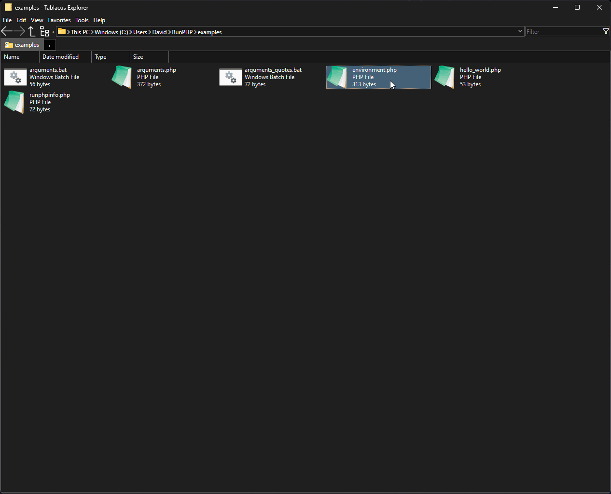

# RunPHP

Run PHP scripts directly from Windows Explorer without creating `.bat` wrappers.



## Installation

1. Extract RunPHP to a permanent directory, such as:

```text id="94fm69"
C:\Tools\RunPHP
```

2. Edit `runphp.ini` and configure your PHP installation.

3. Add the RunPHP directory to your Windows `PATH` if you want to use `runphp` from any terminal.

## Configuration

`runphp.ini` must be located beside `runphp.exe`.

RunPHP accepts either the PHP executable:

```ini id="pr4j29"
[php]
executable=C:\Tools\php83\php.exe
```

or the PHP installation directory:

```ini id="qq8d0s"
[php]
executable=C:\Tools\php83
```

When a directory is specified, RunPHP automatically uses `php.exe` from that directory.

You can optionally configure a directory containing scripts you want RunPHP to find globally:

```ini id="6r18w9"
[scripts]
directory=C:\Tools\PHP-Scripts
```

Runner behavior can also be configured:

```ini id="i4hw8n"
[runner]
pause_on_error=true
pause_after_run=false
```

## Usage

```text id="l7pqoh"
runphp <script> [arguments...]
```

Run a script in the current directory:

```cmd id="3qjqfu"
runphp example
```

The `.php` extension is optional:

```cmd id="qdwjj8"
runphp example.php
```

Arguments after the script name are passed directly to PHP:

```cmd id="r49g65"
runphp resize --width 800 --recursive
```

Run an exact path:

```cmd id="ynw3wd"
runphp "D:\Tools\example.php"
```

Use:

```cmd id="yphj62"
runphp --help
```

for the complete command-line options and script resolution rules.

The `examples/` directory contains additional working examples.

## Troubleshooting

**`Configuration file not found`**

Make sure `runphp.ini` is beside `runphp.exe`.

**`PHP executable not found`**

Check the `[php] executable` setting in `runphp.ini`. It must point to either your PHP executable or the directory containing `php.exe`.

For example:

```ini id="mpklm6"
executable=C:\Tools\php83
```

or:

```ini id="s38zzf"
executable=C:\Tools\php83\php.exe
```

**`runphp` is not recognized as a command**

Add the directory containing `runphp.exe` to your Windows `PATH`, or run `runphp.exe` using its full path.

## Development

Want to build or modify RunPHP?

See `BUILD.md` for the development environment, build process, and repository tests.

## License

RunPHP is released under the Unlicense.
